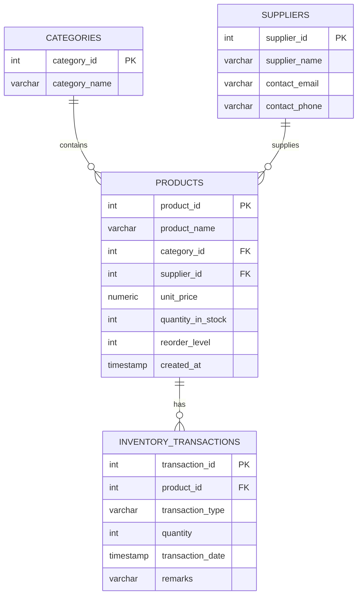

# 📦 Inventory Tracker (SQL + Python CLI)

An intermediate-level inventory management system: a **PostgreSQL** database
(with a view and an auto-update trigger) driven by a **Python command-line
application**. Built as part of an AICTE Summer Internship.

## Made By:
**Candidate Name:** Aditya Ranjan
**Intern ID:** CITS83
**Selected For:** Full Stack Web Development
**Organization:** Codtech IT Solutions Private Limited
**Duration:** 8 Weeks
**Internship Period:** 17 May 2026 - 12 July 2026


---

## 📁 Project Structure

```
inventory-tracker-sql/
├── sql/
│   ├── 01_schema.sql        # Table definitions, keys, constraints, indexes
│   ├── 02_sample_data.sql   # Sample categories, suppliers, products, transactions
│   └── 03_queries.sql       # Reference queries + current_stock_view + trg_update_stock trigger
├── app/
│   ├── __init__.py
│   ├── db.py                 # PostgreSQL connection (reads .env)
│   ├── inventory.py           # Data-access layer (all SQL used by the app)
│   └── cli.py                 # Menu-driven command line interface
├── main.py                   # Entry point -> `python main.py`
├── requirements.txt
├── .env.example               # Template for DB credentials
├── LICENSE
├── .gitignore
└── README.md
```

## 🧩 Entity Relationship Diagram


*(Renders automatically on GitHub.)*

## ⚙️ Tech Stack

- **Database:** PostgreSQL 13+
- **Backend:** Python 3.9+, `psycopg2`, `python-dotenv`
- **Interface:** Command-line (menu-driven)

## 🚀 Getting Started

### 1. Clone the repo
```bash
git clone https://github.com/<your-username>/inventory-tracker-sql.git
cd inventory-tracker-sql
```

### 2. Create the database and load schema + sample data
```bash
createdb inventory_tracker
psql -d inventory_tracker -f sql/01_schema.sql
psql -d inventory_tracker -f sql/02_sample_data.sql
psql -d inventory_tracker -f sql/03_queries.sql
```

### 3. Set up the Python environment
```bash
python -m venv venv
source venv/bin/activate      # on Windows: venv\Scripts\activate
pip install -r requirements.txt
```

### 4. Configure your database credentials
```bash
cp .env.example .env
# then edit .env with your actual PostgreSQL host/user/password
```

### 5. Run the app
```bash
python main.py
```

You'll see a menu like this:
```
==================================================
   📦  INVENTORY TRACKER
==================================================
 1. View all products
 2. Add a new product
 3. Record stock IN (add stock)
 4. Record stock OUT (remove stock)
 5. Low stock alert
 6. Search product by name
 7. View transaction history for a product
 8. Inventory value report
 9. Add category
10. Add supplier
 0. Exit
==================================================
```

## ✨ Features

**Database layer**
- Normalized schema with primary/foreign keys and `CHECK` constraints
- Full stock movement history instead of just a running total
- `current_stock_view` for quick low-stock reporting
- `trg_update_stock` trigger — automatically keeps `quantity_in_stock` in sync
  whenever a transaction is inserted (the app relies on this instead of
  manually updating stock, so the database stays consistent no matter what
  inserts the transaction)
- Indexes on foreign key columns for performance

**Application layer**
- Clean separation of concerns: `db.py` (connection) → `inventory.py`
  (data access / SQL) → `cli.py` (user interface)
- Parameterized queries throughout — no string-built SQL, protecting against
  SQL injection
- Credentials loaded from environment variables via `.env` (never hard-coded,
  never committed)
- Graceful error handling for bad input, invalid IDs, and constraint
  violations (e.g. trying to remove more stock than available)
- Menu-driven CLI covering full CRUD + reporting: add products/categories/
  suppliers, record stock movements, search, low-stock alerts, transaction
  history, and inventory valuation

## 🗺️ Roadmap / Possible Extensions

- [ ] Add a `warehouses` table for multi-location stock
- [ ] Build a web front end (Flask/Django) on top of the same `app/inventory.py` layer
- [ ] Add role-based access (admin vs staff)
- [ ] Export reports to CSV/PDF
- [ ] Dockerize with a `docker-compose.yml` for one-command setup
- [ ] Add automated tests (pytest) for the data-access layer

## 📄 License

This project is licensed under the [MIT License](LICENSE).

## 🙋 Author

Built as part of the **Codtech Summer Internship** program.
